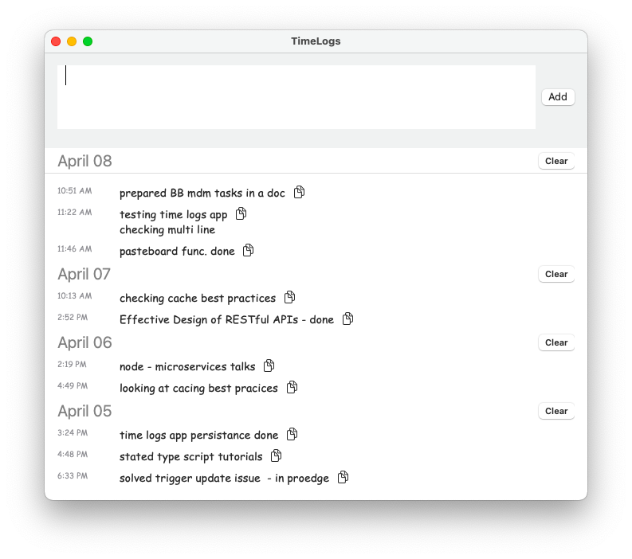

# TimeLogs macOS application (in swiftUI)
(easy notes to list working hrs tasks with auto timestamp)

- Useful while logging time (in EOD/Weekly)

## Featuers:

- [x] multiline text support
- [x] copy to clipboad
- [x] group logs based on date
- [x] clear section wise
- [ ] design improvements
- [ ] convert to status bar app (without using appdelegate with pure SwiftUI ??)

## Installation:

[Download Here](TimeLogs.zip)

Download TimeLogs.zip -> unzip -> drag TimeLogs.app to /Applications folder

**Security Warning:** System Preferences -> Security & Privacy -> General -> Open Anyway

  
   
   

